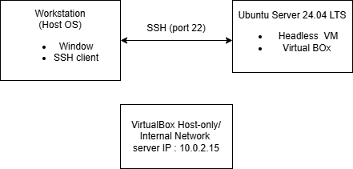
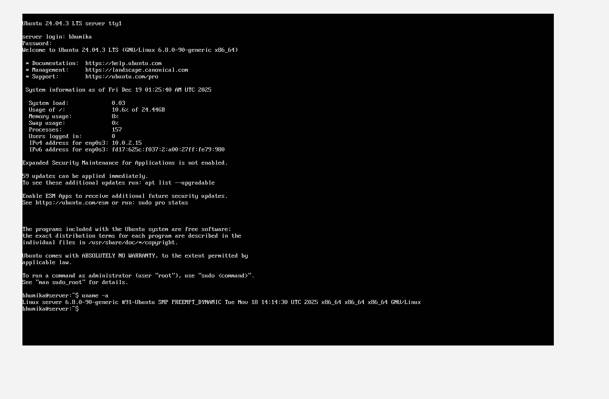
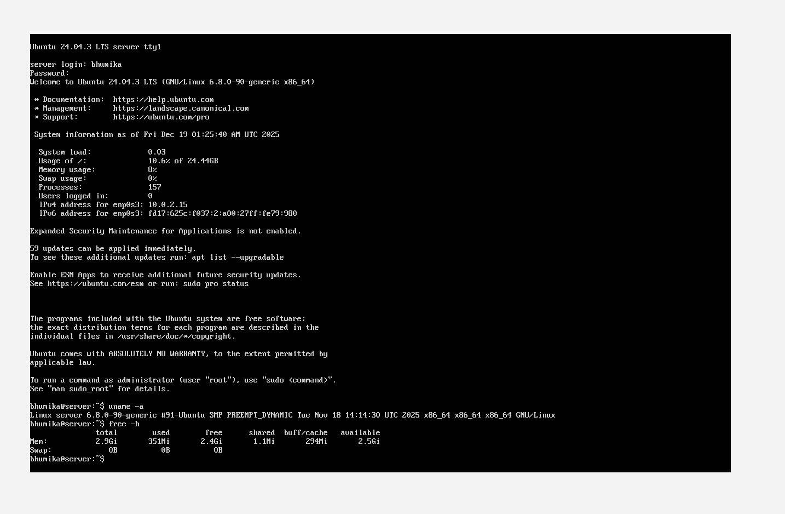
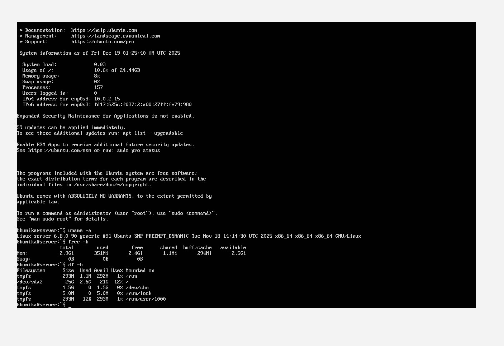
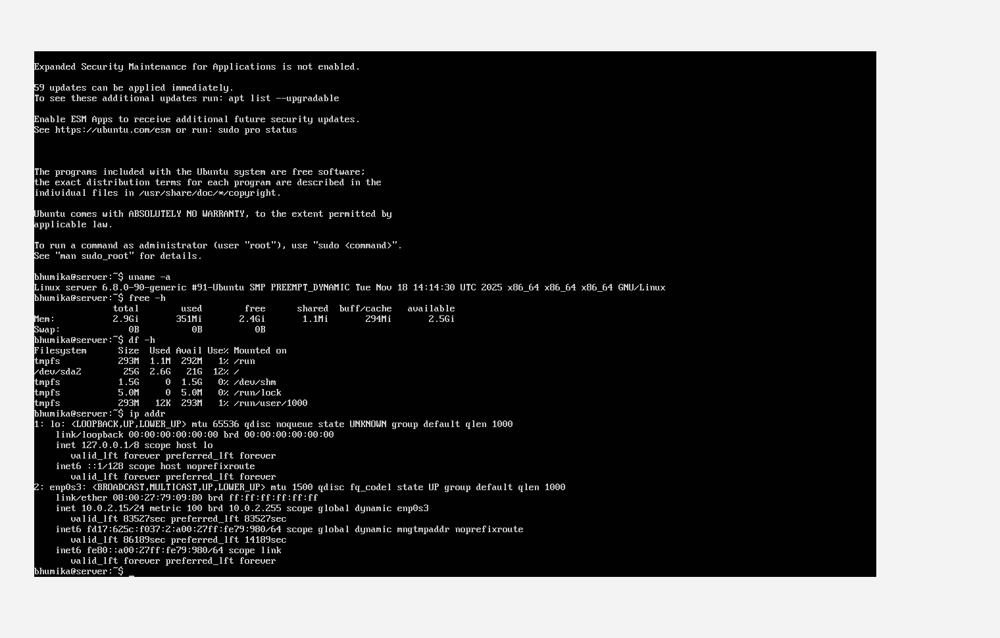
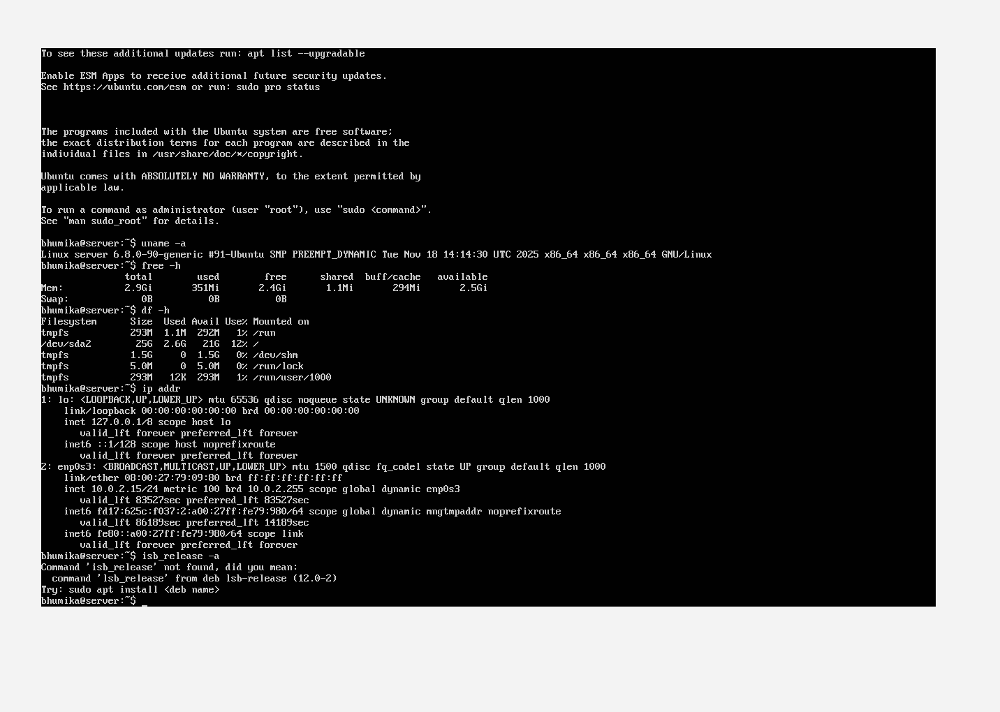

# Week 1 – System Planning and Distribution Selection

## 1. Introduction
This week focuses on planning the system architecture, selecting an appropriate Linux server distribution, and preparing the virtualised environment required for the CMPN202 Operating Systems coursework. The objective is to design a secure, headless Linux server administered remotely via SSH from a workstation.

---

## 2. System Architecture Overview
The system architecture consists of two main components:

### Server
- Headless Linux server running in VirtualBox
- No graphical user interface installed
- Accessed and administered remotely using SSH
- Used for security hardening and performance testing in later weeks

### Workstation
- Host operating system acting as the administrator machine
- Used to connect to the server via SSH
- Runs monitoring and testing scripts

This separation reflects real-world server administration practices.
### System Architecture Diagram :

---

## 3. Network Design
The virtual machines are connected using an isolated VirtualBox network to ensure security and ethical compliance.

**Network configuration:**
- VirtualBox network type: Host-Only / Internal Network
- Static IP addressing for the server
- SSH access restricted to the workstation only (to be enforced later using firewall rules)

This setup ensures the server is not exposed to external or university networks.

---

## 4. Linux Distribution Selection

### Chosen Distribution: Ubuntu Server LTS
Ubuntu Server LTS was selected for the following reasons:
- Long-term security updates and stability
- Extensive documentation and community support
- Industry relevance
- Built-in support for AppArmor (Mandatory Access Control)
- Compatibility with required tools such as Lynis, fail2ban, and systemd

### Alternative Considered
CentOS / Rocky Linux were considered due to their enterprise focus, but Ubuntu Server was chosen due to its simpler configuration and suitability for coursework requirements.

---

## 5. Workstation Choice
The host operating system was chosen as the workstation because:
- It already includes an SSH client
- It avoids the overhead of an additional desktop virtual machine
- It provides direct access to GitHub and monitoring tools

This simplifies system management while still meeting coursework requirements.

---

## 6. Initial System Specification Checks
After installing Ubuntu Server, the following commands were executed on the server to confirm system information:

uname -a
free -h
df -h
ip addr
lsb_release -a 

## Evidence of System Commands

### Kernel and System Information 
uname -a

**Explanation:**  
This screenshot shows the output of the `uname -a` command, which confirms the Linux kernel version, system architecture, and build information. This verifies that the server is running a 64-bit Ubuntu Linux kernel suitable for modern server workloads.
    

---

### Memory Usage
free -h

**Explanation:**  
This screenshot shows the output of the `free -h` command, which displays total, used, and available system memory in a human-readable format. It confirms that sufficient RAM is available on the server for future testing workloads.

---

### Disk Usage
df -h

**Explanation:**  
This screenshot shows the output of the `df -h` command, displaying disk usage across mounted file systems. It confirms the size of the virtual disk and the amount of available storage, which is important for performance testing and system stability.

---

### Network Configuration
ip addr

**Explanation:**  
This screenshot shows the output of the `ip addr` command, listing the server’s network interfaces and assigned IP address. It confirms that the server is using a private IP address within an isolated VirtualBox network, ensuring the system is not exposed externally.

---

### Operating System Version
lsb_release -a

**Explanation:**  
This screenshot shows the output of the `lsb_release -a` command, confirming that Ubuntu Server 24.04 LTS is installed. This ensures long-term support, regular security updates, and suitability for a server environment.

