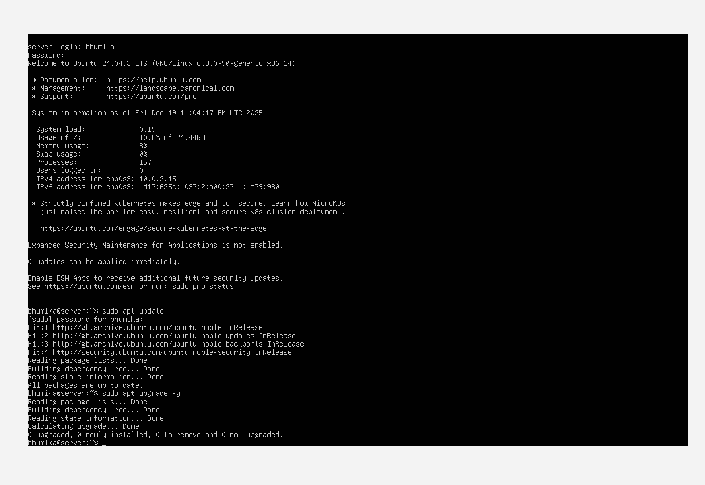
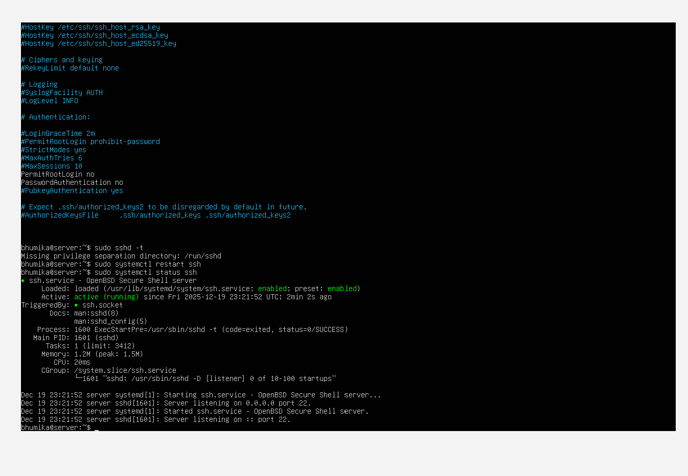
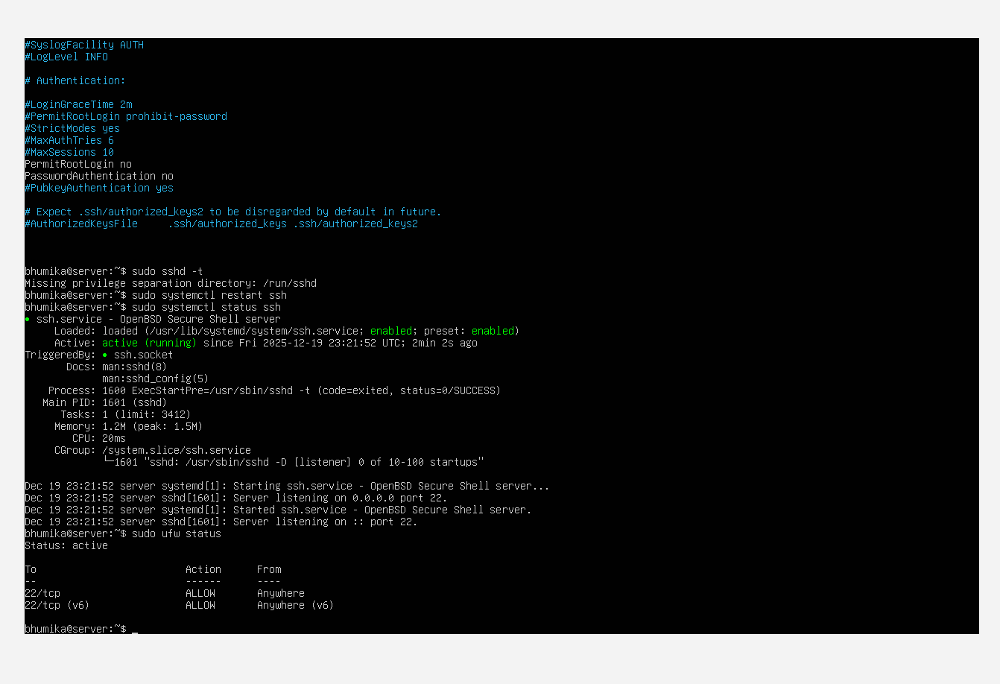
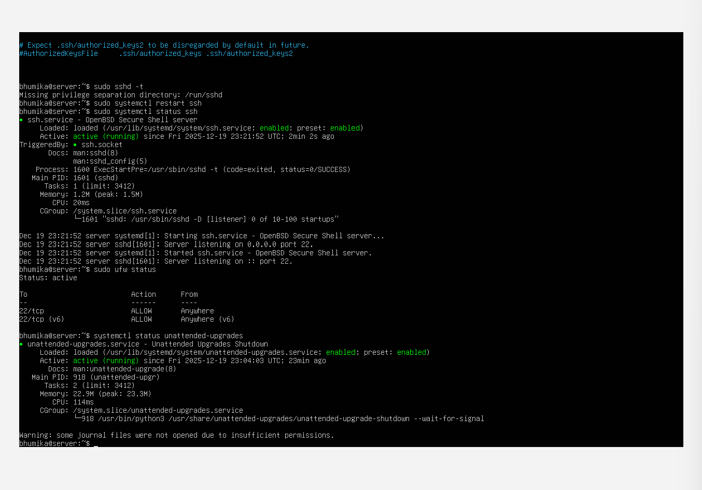

## Week 4 – System Security and Hardening

---

### 1. System Update

The system was updated to ensure all packages and security patches were applied.

---

### 2. SSH Service Status

The SSH service was enabled and verified to be running correctly.

---

### 3. Firewall (UFW) Status

The Uncomplicated Firewall (UFW) was enabled and configured to allow SSH connections.

---

### 4. Unattended Upgrades

Automatic security updates were enabled using unattended-upgrades.

---

### 5. AppArmor Status

AppArmor was verified to be active and enforcing security profiles.

---

## Summary

In Week 4, basic system hardening was performed by updating the system, securing SSH access, enabling a firewall, configuring automatic updates, and verifying AppArmor enforcement.
