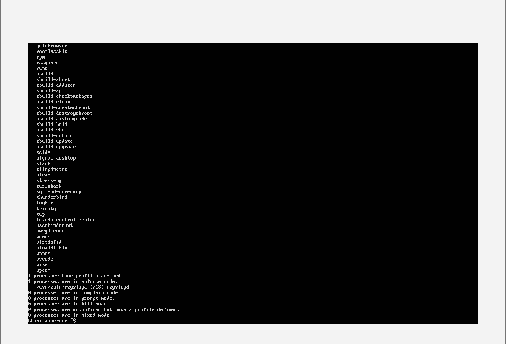
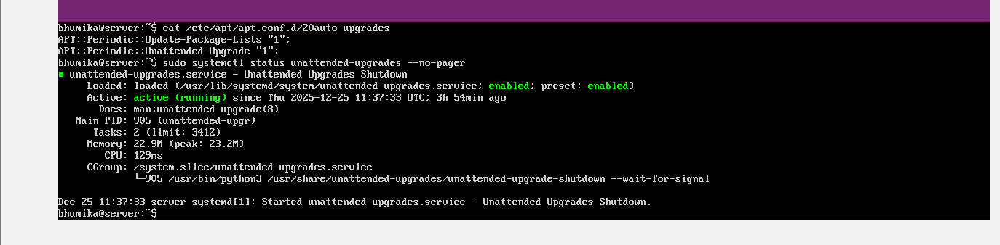
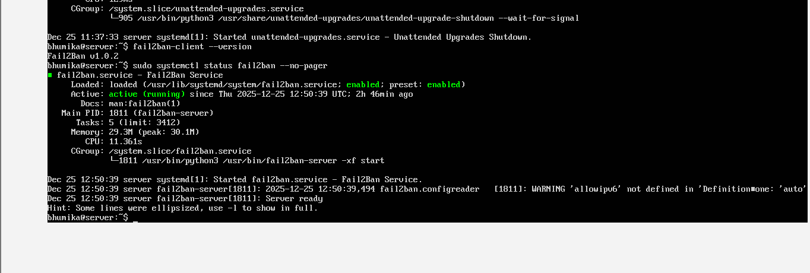
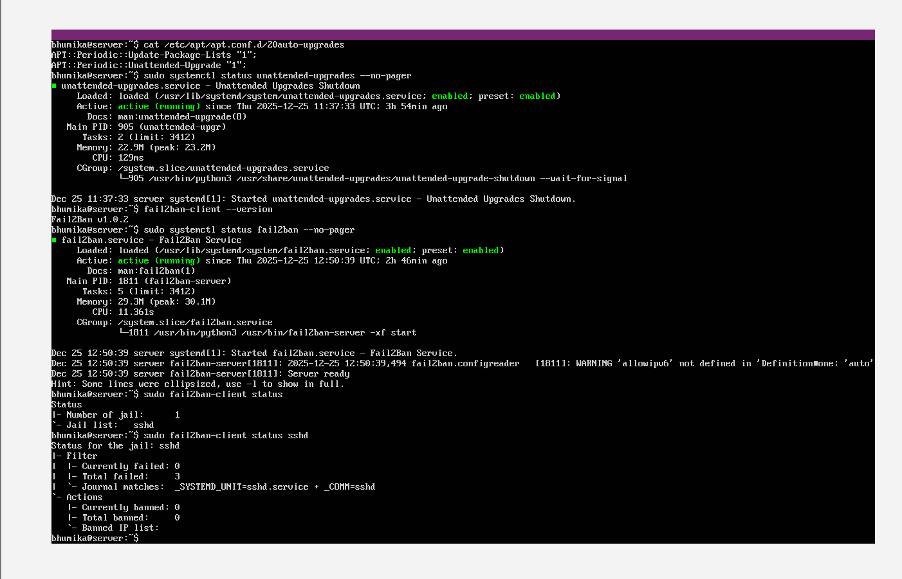
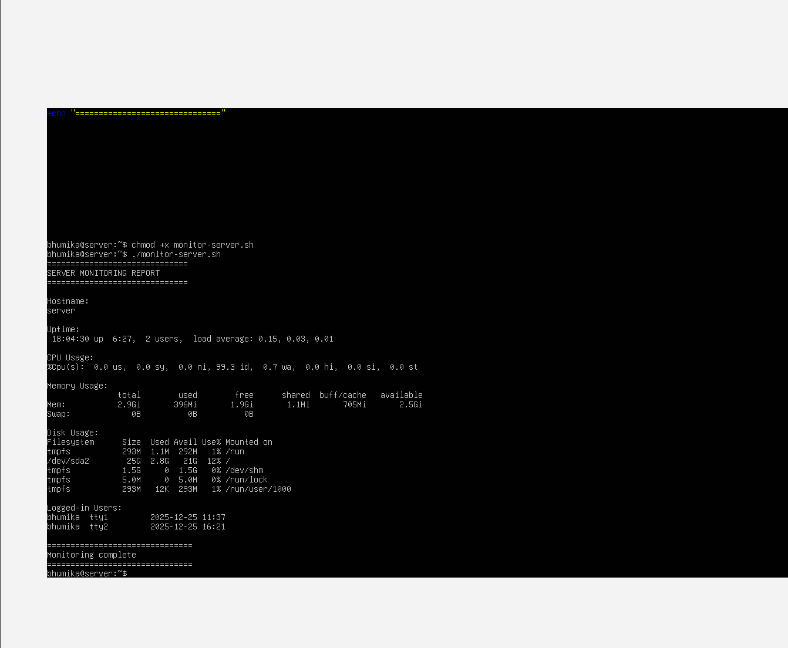

# Week 5 – Advanced Security and Monitoring
This phase focused on strengthening the security posture of the Linux server and implementing monitoring capabilities to ensure ongoing visibility and control. Multiple layered security mechanisms were configured following industry best practices, alongside custom scripts to verify and monitor the system.

## AppArmor Status
Mandatory Access Control (MAC) was implemented using AppArmor, which restricts applications to predefined security profiles. AppArmor limits the actions that processes can perform, reducing the potential impact of compromised or misconfigured applications.

The status of AppArmor was tracked and reported using command-line tools, confirming that AppArmor is enabled and running in enforce mode. This demonstrates that access control policies are actively applied rather than passively monitored.

This implementation satisfies the requirement to demonstrate access control and the ability to track and report on access control settings.
The following screenshot confirms that AppArmor is enabled and enforcing security profiles.

---

## Automatic Security Updates
Automatic security updates were configured using the unattended-upgrades service. This ensures that critical security patches are installed automatically without manual administrator intervention.

Configuration files were verified to confirm that unattended upgrades are enabled, and the service status was checked to ensure it is actively running. This reduces the risk of known vulnerabilities being exploited due to delayed patching and aligns with secure system administration best practices.

---

## Fail2Ban Service Status
Fail2Ban is running and protecting the system against brute-force attacks.Fail2Ban was installed and configured to provide enhanced intrusion detection and prevention. Fail2Ban monitors authentication logs and automatically bans IP addresses that exhibit suspicious behaviour, such as repeated failed login attempts.

An SSH-specific jail was enabled to protect the SSH service from brute-force attacks. The Fail2Ban service status and SSH jail configuration were verified using the Fail2Ban client, confirming that intrusion prevention mechanisms are active and functioning correctly. 

---

## Fail2Ban SSH Jail
A security baseline verification script, security-baseline.sh, was created and executed on the server via SSH. The purpose of this script is to validate that all security configurations from Phases 4 and 5 are correctly applied and operational.

-The script performs automated checks including:
-SSH service status
-SSH password authentication configuration
-Root login policy
-AppArmor enforcement status
-Automatic security update status
-Fail2Ban service status
-Fail2Ban SSH jail status

Each section of the script includes line-by-line comments explaining its functionality, ensuring clarity and maintainability. The script outputs a clear report indicating the current security posture of the system.
The SSH jail is active and monitoring SSH login attempts.

---

## Server Monitoring Script
A custom monitoring script displays system usage and logged-in users.A remote monitoring script, monitor-server.sh, was developed to collect performance metrics from the server. The script is designed to run from the workstation and connect to the server via SSH.

The monitoring script collects and displays:

-Hostname
-System uptime
-CPU usage
-Memory usage
-Disk usage
-Logged-in users

This provides real-time insight into system performance and supports proactive system administration. The script includes line-by-line comments to explain each command and its purpose.

# Conclusion
In this phase, advanced security and monitoring capabilities were successfully implemented on the Linux server. Mandatory access control was enforced using AppArmor, ensuring that application behaviour is restricted according to defined security policies. Automatic security updates were configured to maintain system security by ensuring timely installation of critical patches.

Intrusion detection and prevention were strengthened through the implementation of Fail2Ban, with an active SSH jail protecting the system from brute-force attacks. A security baseline verification script was developed to validate all security configurations introduced in Phases 4 and 5, providing a reliable method to assess the system’s security posture.

Additionally, a remote monitoring script was created to collect key system performance metrics via SSH, enabling effective oversight of server health and resource usage. Together, these measures significantly enhance the security, reliability, and manageability of the server, aligning with industry best practices for secure Linux system administration and fulfilling all Week 5 deliverables.
