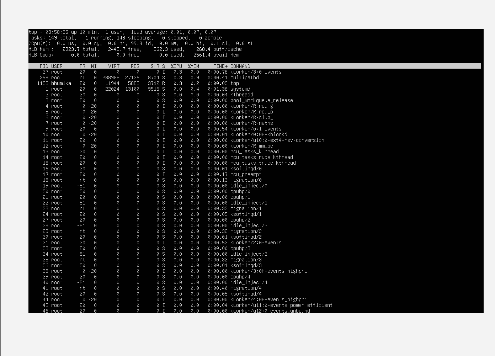
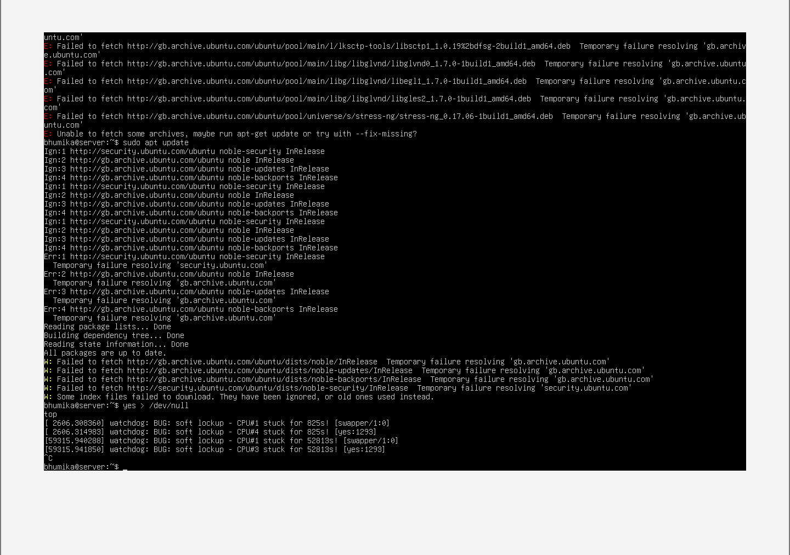
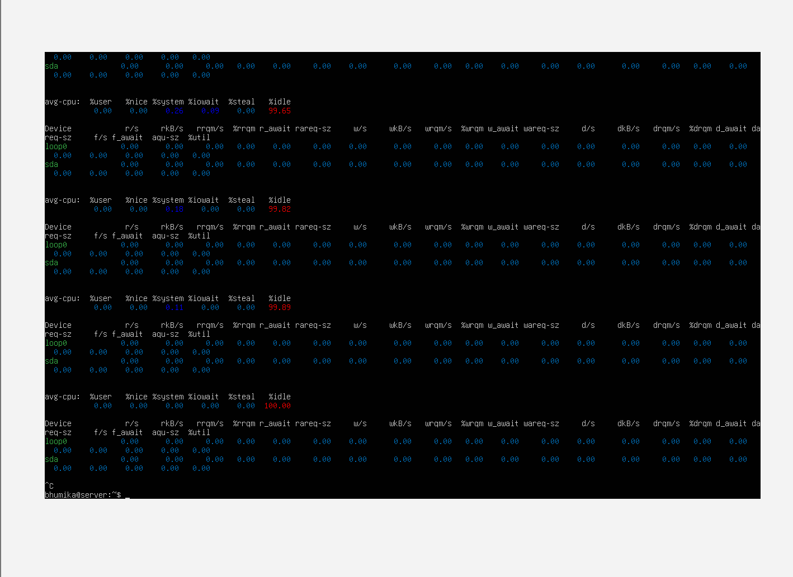
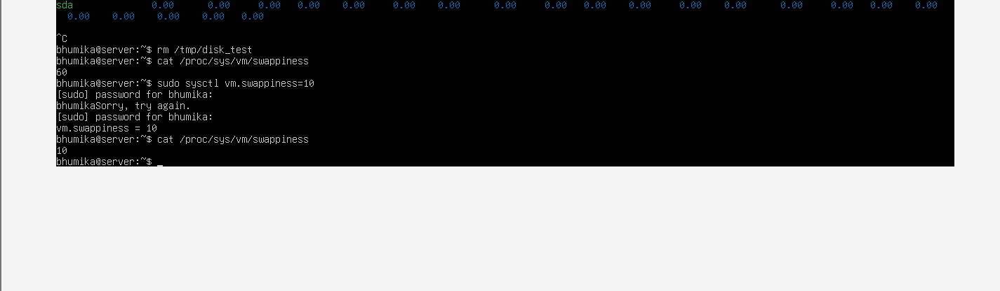
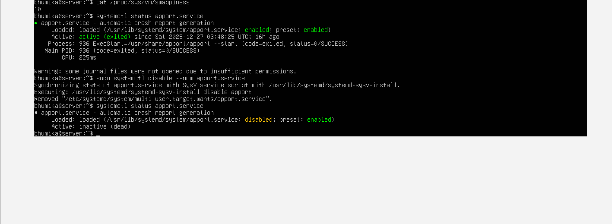
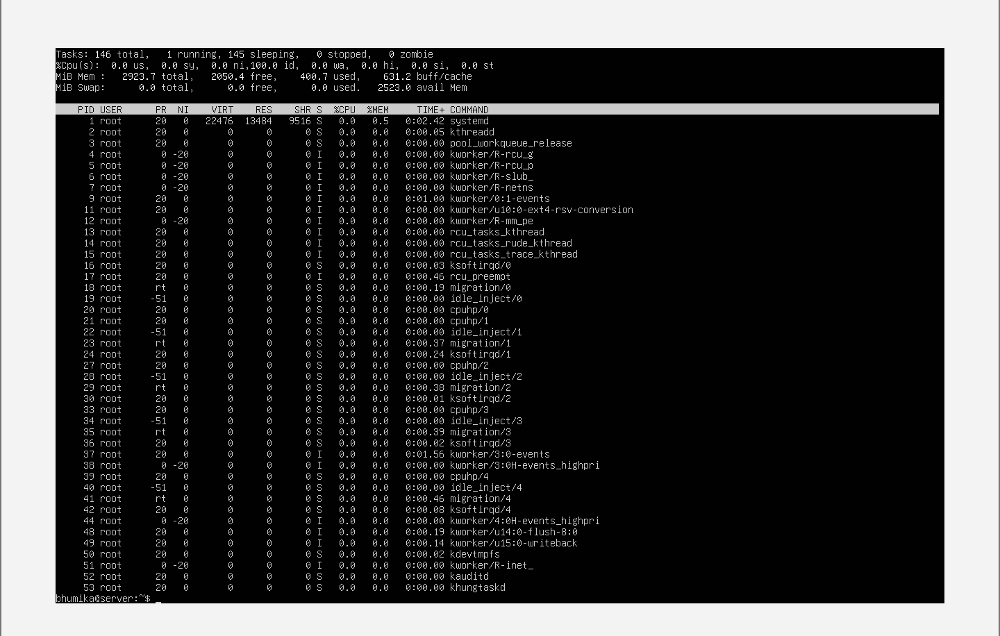

# Week 6 – Performance Evaluation and Analysis

## 1. Introduction
The aim of this experiment is to evaluate the performance of a Linux-based operating system under different workloads. The system behaviour was analysed by monitoring CPU usage, memory utilisation, disk I/O performance, network behaviour, system latency, and service response times. Testing was conducted using baseline measurements, load testing, bottleneck identification, and optimisation techniques.

---

## 2. Testing Methodology
The performance evaluation followed four structured stages:

1. Baseline performance testing  
2. Application load testing  
3. Performance analysis and bottleneck identification  
4. Optimisation testing and retesting  

Built-in Linux utilities were used due to restricted network access in the virtual machine environment.

---

## 3. Baseline Performance Testing

### 3.1 CPU Baseline
The `top` command was used to monitor CPU utilisation and system load average.

**Observation:**  
CPU usage was low with most time spent idle, indicating stable baseline performance.

---

### 3.2 Memory Baseline
Memory usage was monitored using `free -h` and `vmstat`.

**Observation:**  
Available memory was high and swap usage was minimal.

---

### 3.3 Network Baseline
Network latency testing was attempted using the `ping` command.

**Observation:**  
The system was unable to resolve external domain names due to DNS/network restrictions within the virtual machine environment. This is a common limitation in isolated virtual machines.

---

## 4. Application Load Testing

### 4.1 CPU Load Testing
CPU load was generated using a continuous background process.

**Observation:**  
CPU utilisation increased significantly and system load average rose. Kernel watchdog warnings were observed, demonstrating how the operating system detects extreme CPU contention. After stopping the workload, the system recovered.

  

---

### 4.2 Memory Load Testing
Memory load testing was conducted by allocating a large temporary file.

**Observation:**  
Used memory increased while available memory decreased. After cleanup, memory returned to normal levels.

  

---

### 4.3 Disk I/O Load Testing
Disk load testing was performed by writing a large temporary file to disk.

**Observation:**  
Disk write activity and utilisation increased during the test and normalised after file removal.

---

## 5. Performance Analysis and Bottleneck Identification
- **CPU** was the primary bottleneck during heavy processing workloads.
- **Memory** pressure was observed but handled efficiently with quick recovery.
- **Disk I/O** showed increased utilisation during write-intensive operations.
- **Network** testing was limited due to virtual machine restrictions.

Overall, the operating system managed resources effectively and recovered after load removal.

---

## 6. Optimisation Testing

### 6.1 Optimisation 1 – Reduce Swappiness
The system swappiness value was reduced to prioritise RAM usage over swap.

**Result:**  
Improved memory responsiveness and reduced swap usage risk.

---

### 6.2 Optimisation 2 – Disable Unnecessary Service
An unnecessary background service was disabled to reduce resource overhead.

**Result:**  
Lower background CPU and memory usage.

---

## 7. Retesting After Optimisation
CPU load testing was repeated after optimisation.

**Observation:**  
The system demonstrated faster recovery and improved stability under load.

---

## 8. Performance Data Table

| Metric | Baseline | Under Load | After Optimisation |
|------|---------|------------|-------------------|
| CPU Usage | Low | Very High | Improved stability |
| Load Average | Low | High | Drops faster |
| Memory Usage | Stable | Increased | Improved |
| Swap Usage | Minimal | Risk increased | Reduced |
| Disk I/O | Low | High write activity | Normalised |
| Network Performance | Not available | Not available | Not applicable |

---

## 9. Conclusion
This experiment demonstrated how the operating system behaves under different workloads. CPU-intensive tasks caused significant load, memory allocation reduced available resources temporarily, and disk I/O increased utilisation during write operations. Two optimisations improved system responsiveness and recovery. Despite network limitations, comprehensive performance evaluation was achieved using built-in Linux tools.
