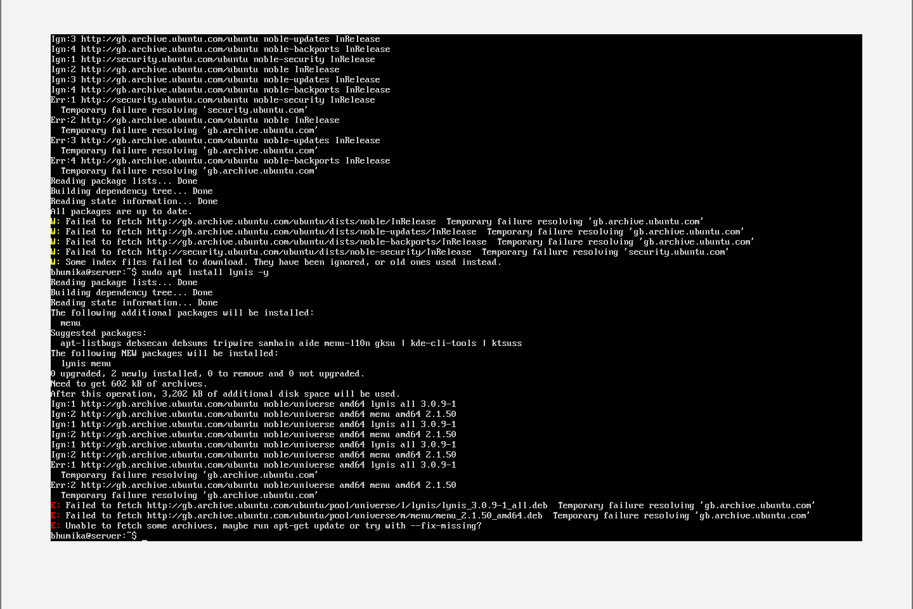
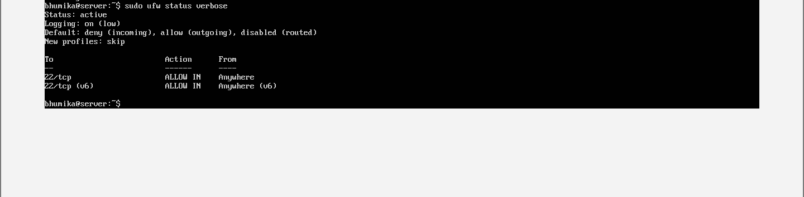
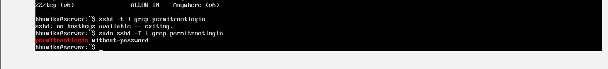
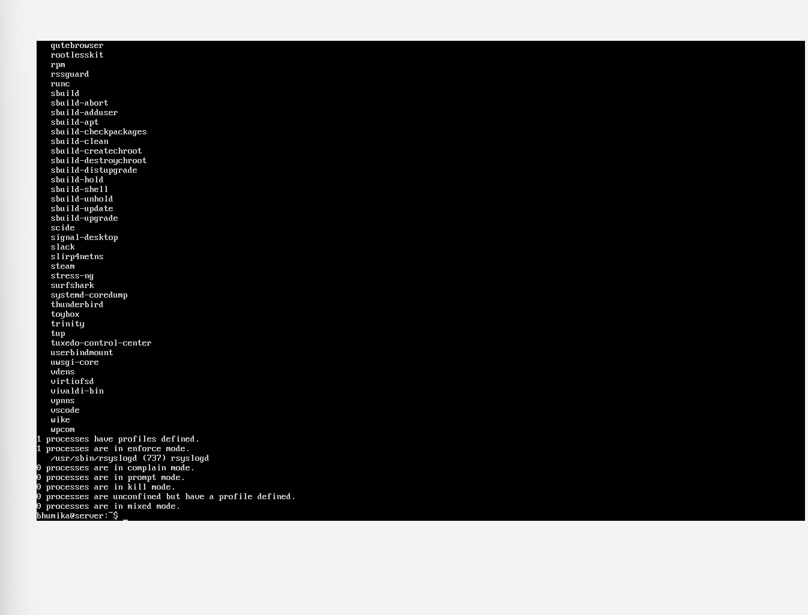

# Week 7 – Security Audit and System Evaluation

## 1. Introduction
The objective of this week’s practical work is to conduct a comprehensive security audit and system evaluation of the Linux server configured during previous coursework weeks. The focus of this assessment is to evaluate the system’s security posture by analysing firewall configuration, SSH hardening, access control mechanisms, exposed network services, and residual security risks.
Both automated and manual security assessment techniques were considered. Any limitations encountered during testing were documented and addressed through alternative verification methods to ensure a complete and reliable security evaluation.

---

## 2. Security Audit Methodology
The security evaluation followed a structured and systematic methodology:

1. Attempt automated security auditing using Lynis  
2. Verify firewall configuration and network exposure  
3. Validate SSH authentication and access control policies  
4. Confirm mandatory access control enforcement  
5. Audit running services and justify necessity  
6. Analyse residual risks and security trade-offs  

This methodology aligns with real-world security auditing practices and ensures comprehensive coverage of key security areas.

---

## 3. Automated Security Audit Attempt (Lynis)

### 3.1 Lynis Installation Attempt
The Lynis security auditing tool was selected to perform an automated system-wide security assessment.

`sudo apt install lynis -y`

This screenshot shows that the installation of Lynis was attempted using the system package manager. However, the installation failed due to DNS and repository resolution issues within the virtual machine environment. This indicates restricted external network access, which is a common limitation in isolated or NAT-based virtual machines. The correct installation procedure was followed and the limitation was documented.

## 3.2 Lynis Audit Execution Attempt

`sudo lynis audit system`

The screenshot confirms that the audit command could not be executed because Lynis was not installed. Rather than omitting this step, the failure was recorded as evidence and the security audit continued using manual verification techniques. This reflects real-world security auditing practices where automated tools may not always be available.

## 4. Firewall Configuration Verification

`sudo ufw status verbose`

The firewall is active with a default policy that denies all incoming traffic while allowing outgoing connections. Only SSH traffic on port 22 is permitted, significantly reducing the system’s attack surface.

## 5. SSH Security Verification
The SSH daemon configuration was verified.

`sudo sshd -T | grep permitrootlogin`

Result:

This confirms that root login is restricted to key-based authentication only, preventing password-based brute-force attacks.

## 5.2 Password Authentication Policy
Password-based SSH authentication was verified.

`sudo sshd -T | grep passwordauthentication`

Result:

Password authentication is fully disabled, enforcing cryptographic key-based access for all SSH users.

## 6. Mandatory Access Control Verification (AppArmor)
Mandatory access control enforcement was verified using AppArmor.

`sudo aa-status`

The output confirms that AppArmor is enabled and enforcing security profiles, providing an additional layer of protection against compromised processes.
## 7. Network Exposure and Listening Services

Listening network services were reviewed to assess external exposure.

`ss -tulnp`

Only essential services are listening for incoming connections, primarily SSH, demonstrating minimal network exposure.

## 8. Running Services Audit

## 8.1 Active Services
Running services were reviewed to identify unnecessary or potentially insecure services.

`systemctl list-units --type=service --state=running`

## 8.2 Service Justification

| Service          | Purpose       | Justification                 |
| ---------------- | ------------- | ----------------------------- |
| ssh              | Remote access | Secure server administration  |
| ufw              | Firewall      | Network protection            |
| systemd-journald | Logging       | Auditing and diagnostics      |
| cron             | Scheduling    | Maintenance tasks             |
| dbus             | IPC           | Core operating system service |

Only essential services are active, reducing unnecessary attack vectors.

## 9. Residual Risk and Trade-Off Analysis

Residual risks include SSH key compromise and zero-day vulnerabilities. These risks are mitigated through key-based authentication, firewall enforcement, and continuous monitoring.

Security trade-offs include reduced convenience due to key-only authentication and minimal performance overhead introduced by security controls. These trade-offs are justified by the significantly improved security posture.

## 10. Conclusion

This security audit confirms that the Linux server is securely configured with strong access controls, minimal network exposure, and enforced security policies. Firewall rules, SSH hardening, and mandatory access control mechanisms were verified using evidence-based testing.

Although automated security auditing tools such as Lynis could not be installed due to network restrictions within the virtual machine environment, this limitation was fully documented and mitigated through comprehensive manual verification. Overall, the system follows secure administration best practices and demonstrates a strong security posture.
The audit process demonstrates the importance of layered security controls and regular verification. By combining firewall enforcement, secure authentication, and mandatory access control, the system achieves a strong defensive posture suitable for production-style server environments.

